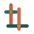

# LOOM — Build Spec & Design Contract (READ FIRST)

This is the single source of truth. Every agent MUST follow it exactly so the
separately-built files combine into one coherent site with zero conflicts.

> **LOOM** — a digital craft studio. Tagline: **"We weave technology."**
> Sub-line: *Websites, apps & AI — woven by hand.*
> The story: a craftsman (wood engineer) who now crafts in code + AI.
> "Digital craftsmanship" is the whole brand. Warm, human, premium, calm —
> NOT a loud generic tech startup. Think: a master's workshop, not a SaaS landing page.

---

## 0. Hard rules (do not break)

- **Pure static site. NO build step, NO frameworks, NO npm.** Plain HTML5 + CSS + vanilla JS only. Must work by opening the file or via GitHub Pages.
- **All internal links are relative** (`href="services.html"`, `href="assets/css/loom.css"`), never absolute paths starting with `/`. GitHub Pages serves from a sub-path, so leading-slash paths break.
- **Mobile-first & fully responsive.** Looks great from 360px to 1600px.
- **Accessible:** semantic HTML, alt text, `aria-label`s on icon links, visible focus states, color contrast AA.
- **No external JS/CSS frameworks.** Google Fonts via `<link>` is the ONLY allowed external resource.
- **Bilingual-friendly but English-first.** Keep copy clean; a few tasteful Arabic touches are welcome (see brand). Do not make it RTL.
- **Privacy:** Contact email is `mofakhori@gmail.com` ONLY. Do NOT put any personal name, phone number, or home address anywhere. The founder is referred to only as "the studio" / "we" / "Loom".
- Stay strictly inside your assigned files (listed in your prompt). Do not create or edit files owned by another agent.

---

## 1. Brand identity

**Name:** LOOM (display it uppercase as a wordmark: `LOOM`).
**Tagline:** We weave technology.
**Sub-line:** Websites, apps & AI — woven by hand.
**Voice:** confident, warm, plain-spoken, a little poetic. Short sentences. No corporate fluff, no buzzword soup. Speak like a skilled maker who respects the client.
**Signature motif:** **woven threads** — thin lines that cross over/under like a loom's warp & weft. Used in the hero animation, section dividers, and as texture.

### Color tokens (use these exact CSS variables)
```
--paper:      #F7F2E9;  /* warm parchment background */
--paper-2:    #EFE7D8;  /* slightly deeper panel */
--ink:        #1C1814;  /* near-black warm text */
--ink-soft:   #4A423A;  /* secondary text */
--thread:     #C75B39;  /* terracotta — primary accent (warp) */
--thread-2:   #1F4E4A;  /* deep teal — secondary accent (weft) */
--gold:       #B8884B;  /* woven gold — small highlights */
--line:       #D8CDB9;  /* hairline borders on paper */
--paper-card: #FCF9F2;  /* raised card surface */
--shadow:     0 1px 2px rgba(28,24,20,.05), 0 8px 30px rgba(28,24,20,.07);
```
Dark sections (e.g. footer, a feature band) may invert: bg `--ink`, text `--paper`, accents stay `--thread`/`--gold`.

### Typography (Google Fonts only)
- Display / headings: **Fraunces** (variable serif) — `font-family: 'Fraunces', Georgia, serif;` weight 400–600, optical sizing on, slight `letter-spacing:-0.01em` for big sizes.
- Body / UI: **Inter** — `font-family: 'Inter', system-ui, sans-serif;`
- Load with:
```html
<link rel="preconnect" href="https://fonts.googleapis.com">
<link rel="preconnect" href="https://fonts.gstatic.com" crossorigin>
<link href="https://fonts.googleapis.com/css2?family=Fraunces:opsz,wght@9..144,400;9..144,500;9..144,600&family=Inter:wght@400;500;600&display=swap" rel="stylesheet">
```
- Scale (fluid): h1 `clamp(2.6rem,6vw,5rem)`, h2 `clamp(1.9rem,3.5vw,3rem)`, h3 `clamp(1.2rem,2vw,1.6rem)`, body `1.0625rem/1.7`.

### Spacing / shape
- Max content width `1180px`, centered, side padding `clamp(1.25rem,5vw,4rem)`.
- Section vertical padding `clamp(4rem,9vw,8rem)`.
- Radius: cards `14px`, buttons `10px`, pills `999px`.
- Hairlines use `--line`. Generous whitespace. Editorial, calm.

---

## 2. Shared CSS class vocabulary (design agent implements; page agents use)

Layout: `.wrap` (max-width container), `.section`, `.section--ink` (dark band), `.grid`, `.grid-2`, `.grid-3` (responsive auto-fit cards), `.eyebrow` (small uppercase label in `--thread`, letter-spacing .14em).

Type: `.display` (hero h1), `.lede` (large intro paragraph, `--ink-soft`), `.muted`.

Components:
- `.btn` (base), `.btn--primary` (filled `--ink` bg, paper text), `.btn--ghost` (outline hairline), `.btn--thread` (terracotta fill). Buttons have a subtle hover lift.
- `.card` (paper-card bg, radius 14, `--shadow`, hairline border, padding clamp).
- `.pill` (rounded tag, hairline border, small).
- `.thread-rule` (a 1px woven divider line).
- `.nav`, `.nav__inner`, `.nav__logo`, `.nav__links`, `.nav__cta`.
- `.footer`, `.footer__inner`.
- `.reveal` (starts opacity 0, translateY(16px); JS adds `.is-in` to fade/slide in on scroll via IntersectionObserver). Respect `prefers-reduced-motion`.

JS (in `assets/js/loom.js`) provides: (a) the hero woven-thread canvas animation, (b) IntersectionObserver scroll-reveal for `.reveal`, (c) mobile nav toggle, (d) current-year in footer (`[data-year]`). Pages just include `<script src="assets/js/loom.js" defer></script>` and use the classes/data-attributes — they do NOT write their own JS.

---

## 3. EXACT shared `<head>` boilerplate (paste into every page, edit the title/description/canonical per page)

```html
<!DOCTYPE html>
<html lang="en">
<head>
  <meta charset="UTF-8">
  <meta name="viewport" content="width=device-width, initial-scale=1.0">
  <title>PAGE_TITLE — LOOM</title>
  <meta name="description" content="PAGE_DESCRIPTION">
  <meta name="theme-color" content="#F7F2E9">
  <meta property="og:title" content="LOOM — We weave technology">
  <meta property="og:description" content="Websites, apps & AI, woven by hand. A digital craft studio.">
  <meta property="og:type" content="website">
  <meta property="og:image" content="assets/img/og.svg">
  <meta name="twitter:card" content="summary_large_image">
  <link rel="icon" href="assets/img/favicon.svg" type="image/svg+xml">
  <link rel="preconnect" href="https://fonts.googleapis.com">
  <link rel="preconnect" href="https://fonts.gstatic.com" crossorigin>
  <link href="https://fonts.googleapis.com/css2?family=Fraunces:opsz,wght@9..144,400;9..144,500;9..144,600&family=Inter:wght@400;500;600&display=swap" rel="stylesheet">
  <link rel="stylesheet" href="assets/css/loom.css">
</head>
<body>
```

## 4. EXACT shared NAV (paste identical at top of `<body>` on every page)

Mark the current page's link with `aria-current="page"`.

```html
<header class="nav">
  <div class="nav__inner wrap">
    <a class="nav__logo" href="index.html" aria-label="LOOM home">
      
      <span>LOOM</span>
    </a>
    <button class="nav__toggle" aria-label="Menu" aria-expanded="false">
      <span></span><span></span><span></span>
    </button>
    <nav class="nav__links" aria-label="Primary">
      <a href="index.html">Home</a>
      <a href="services.html">Capabilities</a>
      <a href="work.html">Work</a>
      <a href="about.html">Studio</a>
      <a class="btn btn--thread nav__cta" href="about.html#contact">Start a project</a>
    </nav>
  </div>
</header>
```

## 5. EXACT shared FOOTER (paste identical at end of `<body>`, before scripts, on every page)

```html
<footer class="footer section--ink">
  <div class="footer__inner wrap">
    <div class="footer__brand">
      <span class="footer__logo">LOOM</span>
      <p class="muted">We weave technology — websites, apps & AI, woven by hand.</p>
    </div>
    <nav class="footer__nav" aria-label="Footer">
      <a href="index.html">Home</a>
      <a href="services.html">Capabilities</a>
      <a href="work.html">Work</a>
      <a href="about.html">Studio</a>
      <a href="about.html#contact">Contact</a>
    </nav>
    <div class="footer__contact">
      <a href="mailto:mofakhori@gmail.com">mofakhori@gmail.com</a>
      <p class="muted">© <span data-year>2026</span> LOOM. Crafted, not generated.</p>
    </div>
  </div>
</footer>
<script src="assets/js/loom.js" defer></script>
</body>
</html>
```

---

## 6. Capabilities (canonical list & descriptions — use these everywhere)

1. **Websites & Web Apps** *(lead)* — fast, beautiful, bilingual (EN/AR) sites & web apps that win clients. Hand-built, no bloated templates.
2. **AR & Custom Apps** *(lead)* — augmented-reality experiences and bespoke mobile/desktop apps. The "wow" layer for products & spaces.
3. **AI Agent Teams & Bots** — fleets of AI agents that automate real work: support bots, content engines, research, ops. (Our own edge: we build *with* AI agent teams, so we ship faster.)
4. **CRM & Business Systems** — CRM setup, internal tools, dashboards, automations that organize a whole business.
5. **IT & Development** — full-stack development, integrations, hosting, the technical backbone.
6. **Brand & Design** — identity, design systems, and the craft that makes all of the above feel premium.

## 7. Real work / case studies (Work page — factual, present as LOOM's portfolio)

Present these as Loom's craftsmanship. Keep tasteful; do NOT expose private personal details.

- **Plexus Workshop** — a premium woodworking brand site. Next.js, deployed on Vercel, custom product renders, bilingual feel, built to drive real B2B leads & sales. Live craftsmanship-meets-web. *(Result framing: turned a workshop into a recognized online brand that attracts clients.)*
- **Inner Garden / بُستان الرُّوح** — an Arabic-first (RTL) breathing & meditation web app. Calming UX, freemium model, self-contained and fast. Shows our range from utility to emotional, culturally-rooted product design.
- **Huroofi** — an Arabic educational printables "factory": a Node + headless-Chrome engine that renders beautiful Arabic HTML into print-ready PDFs at scale. Shows automation + Arabic typography mastery + productized systems.
- **The Grove** — a bilingual concept site crafted to help a local hospitality/space brand present itself beautifully online. (Describe as a recent studio project; keep the client generic — "a local brand".) 
- **AI Agent Teams (internal)** — Loom builds with orchestrated AI agent fleets (parallel "weavers") — the same capability we deploy for clients to automate support, content, and ops.

Each case study card: project name, one-line what-it-is, 2–3 sentence story, the capabilities used (as `.pill`s), and an honest outcome/voice line. If you reference a live URL, only `www.plexusworkshop.com` is public-safe.

## 8. Page responsibilities (who builds what)

- `index.html` — Home: hero (woven animation), positioning, capabilities overview (link to services), 2–3 featured work teasers (link to work), the "built with AI agent teams" differentiator, process glimpse, strong CTA. The showcase piece.
- `services.html` — Capabilities: deep dive into all 6 capabilities (section 6), each with what/why/how-we-do-it, "what we can build together" angle, and a CTA. Title: "Capabilities".
- `work.html` — Work: the case studies (section 7) as a rich, editorial portfolio. Title: "Work".
- `about.html` — Studio: the digital-craftsmanship story, how we work (process: thread → weave → finish), why "crafted, not generated", the AI-agent-team advantage, FAQ, and the `#contact` section (email CTA to mofakhori@gmail.com; a mailto button; optionally a simple form that uses `mailto:` action). Title: "Studio".

Keep nav/footer/head IDENTICAL across all four (sections 3–5). Use `.reveal` generously. Make it feel handcrafted and alive.
